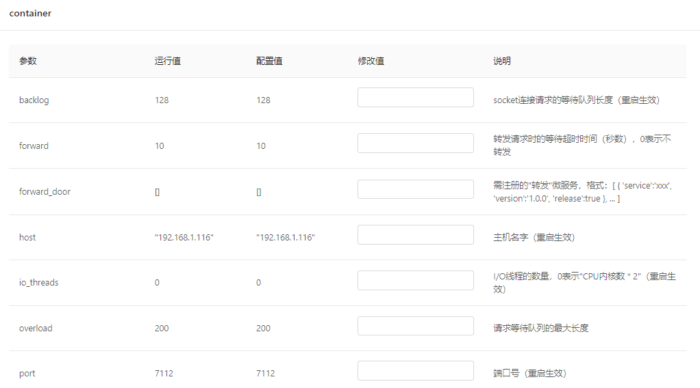

# 接口注解

---

UBSI的接口注解包括：

- @USEntry - 声明服务接口
- @USParam - 声明接口参数
- @USBefore - 声明前置拦截方法
- @USAfter - 声明后置拦截方法
- @USInit - 声明初始化方法
- @USClose - 声明结束方法
- @USInfo - 声明获取运行信息的方法
- @USConfigGet - 声明获取配置参数的方法
- @USConfigSet - 声明设置配置参数的方法


### @USEntry

用来声明微服务的接口，例如：

```java
@UService(
	name = "my.samples.demo"
)
public class DemoService {
	@USEntry(
		tips = "回显",			// 接口的说明
		params = {
			@USParam(			 // 第一个参数，可以有多个
				name = "args",	 // 参数的名字
				tips = "参数"		// 参数的说明
			)
		},
		result = "返回传入的参数",	 // 结果的说明
		readonly = true,		 // 是否是"只读"接口，缺省为true
		timeout = 1				 // 超时时间（秒数），缺省为1
	)
	public Object echo(ServiceContext ctx, Object args) {
		return args;
	}
}
```

注意：

* 被标注方法的第一个参数必须是ServiceContext（通过该参数可以获得请求的上下文），后续可以附加任意数量的参数
* 附加参数的说明应该放在@USEntry注解的params属性中，必须按照顺序一一对应，以生成正确的接口文档
* 附加参数以及返回结果的数据类型必须是UBSI支持的基础数据类型，详见["UBSI基础数据类型"](../data-type.md)
* readonly属性用来声明该接口是否会改变微服务的运行状态或数据，UBSI服务容器可以根据这个属性来设置访问权限
* timeout属性用来声明该接口"正常"的处理时间，UBSI服务容器可以根据这个属性来发现处理超时的请求
* 被标注的方法必须是public的（非static），并且不能重名
* 在运行时，每次服务请求都会使用一个新的@UService实例，所以接口方法不需要考虑并发重入造成的冲突（除非是对静态数据的访问）

### @USParam

用在@USEntry注解的params属性中，声明接口的参数，示例请见@USEntry注解。

### @USBefore | @USAfter 

可以用在@UService或@USFilter声明的Class中，定义在一个服务请求"开始"或"结束"时的拦截动作，例如：

```java
@UService(
	name = "my.samples.demo"
)
public class DemoService {
	@USBefore(
		timeout = 1		// 超时时间（秒数），缺省为1
	)
	public void before(ServiceContext ctx) throws Exception {
		ctx.getLogger().info("开始处理一个请求");
	}
	
	@USAfter(
		timeout = 1		// 超时时间（秒数），缺省为1
	)
	public void after(ServiceContext ctx) throws Exception {
		ctx.getLogger().info("完成了一个请求的处理");
	}
}
```

注意：

* 被标注的方法只能有一个ServiceContext参数，可以通过该参数获得请求的内容或者容器的上下文环境，更多详情可以参见[ServiceContext的API](../service-context.md)
* @UService的before/after只能拦截对本服务的请求，@USFilter可以拦截本容器内所有微服务的请求

### @USInit | @USClose

微服务/过滤器的初始化动作，示例：

```java
@UService(
	name = "my.samples.demo"
)
public class DemoService {
	@USInit
	public static void init(ServiceContext ctx) throws Exception {
		ctx.getLogger().info("微服务启动，进行初始化");
	}

	@USClose
	public static void close(ServiceContext ctx) throws Exception {
		ctx.getLogger().info("微服务关闭，进行清理");
	}
}
```

注意：

* 被标注的必须是public static方法，且只有一个ServiceContext参数
* 当开始加载微服务/过滤器，或者是监控工具"停止 | 启动"服务时，容器会调用这两个方法
* 如果没有必要，可以不使用这两个注解

### @USInfo

用来向UBSI治理工具报告运行信息的接口，示例：

```java
	/** 返回运行信息 */
	@USInfo
	public static Object info(ServiceContext ctx) throws Exception {
		return "当前的运行数据，可以是自定义的数据结构";
	}
```

注意：

- 被标注的必须是public static方法
- @USInfo接口不能被外部直接访问，而是通过UBSI容器封装的监控接口来调用，有可能会在@USInit之前或@USClose之后被访问
- 如果没有必要，可以不使用这个注解

### @USConfigGet | @USConfigSet

UBSI微服务可以通过这两个注解实现运行时的动态参数配置，示例：

```java
	/** 返回配置参数 */
	@USConfigGet
	public static Object getConfig(ServiceContext ctx) throws Exception {
		return "这是配置参数";
	}

	/** 设置配置参数 */
	@USConfigSet
	public static void setConfig(ServiceContext ctx, String json) throws Exception {
		//todo 处理传入的配置参数
	}
```

注意：

* 被标注的必须是public static方法

* @USConfigGet可以返回任意数据结构的配置参数，UBSI配置管理工具会将其转换为json格式的字符串展示给管理员，并将修改后的配置（json格式字符串）传递给@USConfigSet进行处理。UBSI治理工具可以通过这两个接口对微服务进行动态配置，为了适应不同微服务的不同配置方式，UBSI治理工具对@USConfigGet返回的数据格式有个默认约定，示例如下：

  ```json
  {
    "param1": "配置参数的当前值",
    "param1_restart": "配置参数的配置值（可能需要微服务重启后才能生效）",
    "param1_comment": "配置参数的说明",
    
    "param2": { ... },
    "param2_restart": { ... },
    "param2_comment": { "参数属性的名字": "参数属性的说明", ... }
  }
  ```

  其中"\_restert"和"\_comment"是默认的后缀，分别表示该项参数的"配置值"和"说明"；如果某项参数是一个"键值对"，则其对应的"\_comment"为该参数各个键值属性的说明。遵循这种约定，UBSI治理工具可以构造出下面的参数配置界面：（以服务容器的参数配置为例）

  

* 如果需要将配置参数保存为本地的配置文件，@USConfigSet可以通过ServiceContext提供的API获得本地配置文件的存放路径等环境信息；通常情况下，@USConfigSet设置的是每个服务实例的**运行参数**，不同的服务实例可以有不同的运行参数

* 这两个接口不能被外部直接访问，而是通过UBSI容器封装的监控接口来调用，有可能会在@USInit之前或@USClose之后被访问

* 如果没有必要，可以不使用这两个注解

