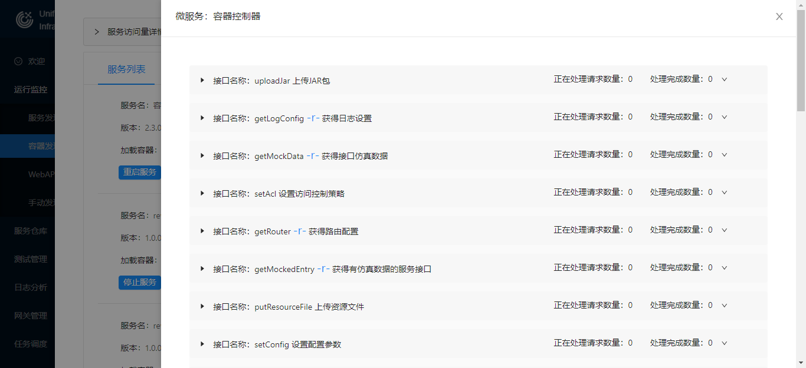

# UBSI服务容器

---

服务容器(UBSI Container)是UBSI平台的核心组件，容器是可以独立运行的节点，用来装载微服务的运行实例。容器为微服务提供了：

- 运行时的上下文环境
- 动态部署、启动、暂停、卸载等生命周期管理
- 向注册中心注册
- 处理数据通讯、并发调度、流量控制
- 访问控制、动态参数配置
- 服务依赖、访问链路跟踪
- "单例"服务的运行状态控制
- 分布式事务协调
- 访问计数及访问日志

每个容器可以部署多个微服务的实例，同一个微服务的多个实例也可以分别部署在不同容器中（并行或主备）；同时，每个容器还会包含一个公共的Consumer组件，以管理和跟踪微服务之间的相互调用；这样的多个容器构成了UBSI的服务网格(Service Mesh)，微服务之间的相互调用实际上都是发生在"容器<=>容器"之间，都在容器的"观察和管控"之下，由此才构建出了高度一体化的UBSI微服务治理能力。


容器是UBSI最基础的治理单元，每个运行时的容器都会自带一个"容器控制器"，这也是一个标准的UBSI微服务，通过一系列接口为治理工具提供了容器以及其中微服务实例的配置/监控/安装卸载等功能。



> 与其他微服务不同的是，容器控制器的名字为""，可以关闭或重启，但不可停止或卸载


#### 容器的运行参数配置

容器的运行参数保存在配置文件rewin.ubsi.container.json中，一个样例如下：

```json
{
  "host": "container-hostname",
  "port": 7112,
  "backlog": 128,
  "io_threads": 4,
  "work_threads": 20,
  "overload": 200,
  "timeout_fuse": 0,
  "forward": 0,
  "forward_door": []
}
```

- host | port

  容器所在服务器的访问地址（建议使用DNS域名，不建议使用IP）和端口

- backlog

  建立socket连接的等待队列长度

- io_threads

  用来处理socket I/O的线程数，0表示默认设置（CPU内核数 * 2）

- work_threads

  处理服务请求的并发线程数量

- overload

  等待处理的请求队列长度，如果等待队列已满，新的请求会被拒绝

- timeout_fuse

  当某个服务接口超时的数量达到多少个后熔断（拒绝该接口的后续请求），0表示不熔断

- forward

  转发请求时的等待超时时间（秒数），0表示不转发

- forward_door

  需注册的"转发"微服务


容器通过work_threads/overload/timeout_fuse实现并发及流量控制；开放"forward"的容器可以被视为一个"边界"容器，配合forward_door以及容器内Consumer组件的静态路由设置，可以构造出"多治理域"的微服务运行环境，这对于拥有大规模微服务部署实例的场景（如技术中台）是有意义的，可以实现微服务的"分区"治理。

> 对于容器的运行实例，不需要手工修改配置参数，可以通过UBSI治理工具进行动态配置


#### 注册中心配置

如果需要给容器添加注册中心的配置，还需要在rewin.ubsi.consumer.json配置文件中设置redis的访问参数，详见 [Consumer组件](consumer.md)。


