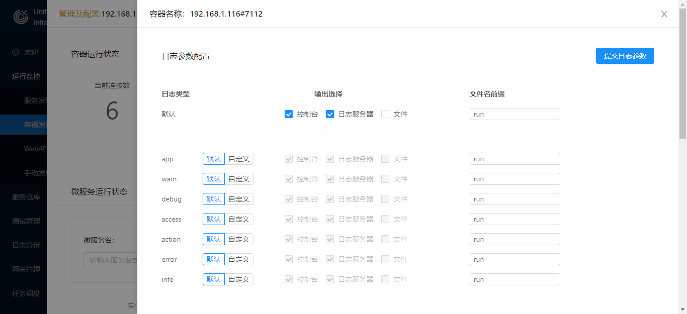
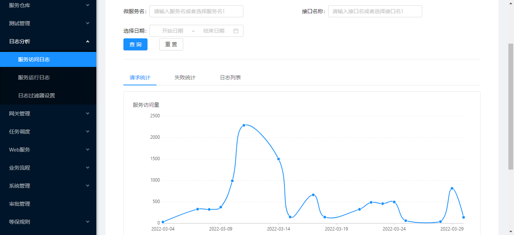

# 分布式日志

---

UBSI为微服务的开发提供了一套完整的日志处理框架：

- Consumer组件提供了Logger API
- 可以通过配置来指定不同类型日志的输出方式，包括：console、log-file、远程的日志服务
- 日志数据的"输出"是独立的后台任务通过异步方式进行批量处理，不影响正常任务的处理效率
- 可以通过独立部署的rewin.ubsi.logger日志微服务，来统一收集其他各处（包括微服务/应用等）产生的日志，并利用UBSI的日志工具进行分析
- 可以通过配置来指定对微服务的请求进行"跟踪"，服务容器/Consumer组件会自动产生相应的请求/处理日志，并利用UBSI的日志工具进行访问链路分析
- 支持slf4j日志接口（默认的输出级别为WARN）


以服务容器的一条"启动"日志为例（日志的默认配置是输出到console），看一下日志数据的格式：

```
[INFO]	2022-03-28 14:36:23.267	liuxd-hp#7112	rewin.ubsi.container	rewin.ubsi.container	[1]rewin.ubsi.container.Bootstrap#start()#154	startup	"2.3.0"
```

其中：

- [INFO]

  日志类型，其他还可以有：DEBUG(测试)、WARN(警告)、ERROR(错误)、ACTION(操作)、ACCESS(访问) 等，应用还可以使用自定义的类型，表示为：[APP#??]

- 2022-03-28 14:36:23.267

  产生日志的时间戳，如果系统时区和JVM时区有差异，可以在启动java应用时指定时区参数，比如：

  `java -Duser.timezone=GMT+8 -jar xxxx.jar`

- liuxd-hp#7112

  输出日志的应用所在的位置

- rewin.ubsi.container

  应用的分类标签

- rewin.ubsi.container

  应用的ID

- [1]rewin.ubsi.container.Bootstrap#start()#154

  日志输出语句所在的代码位置（[线程编号]类#方法()#行号）

- startup

  日志的输出消息

- "2.3.0"

  日志的附加数据（json格式字符串）


对于Consumer应用，可以通过 `Context.getLogger()` 获得Logger对象；对于微服务，应该使用 ServiceContext对象的 `getLogger()` 来获得Logger对象。


Logger对象产生的日志可以通过UBSI治理工具来设置"输出"方式：




输出到"日志服务器"意味着将不同节点上的各个应用的日志数据都发送到rewin.ubsi.logger日志服务，并统一保存到mongo数据库中。这种机制实现了分布式环境下的日志集中收集，并可以通过UBSI治理工具进行统计分析：



