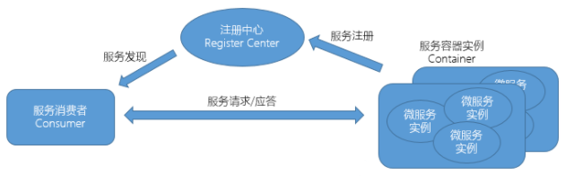
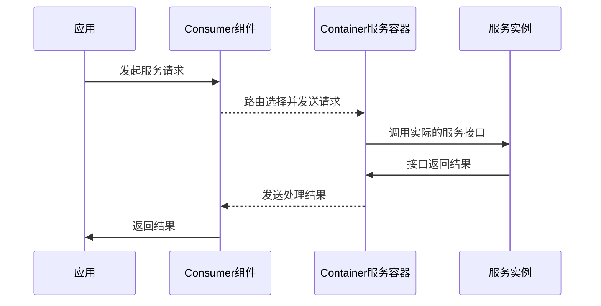

# UBSI核心组件

---

UBSI运行时的核心架构如下：

- 服务注册

  UBSI采用redis作为注册中心，UBSI的Container服务容器负责定时将容器位置、各服务实例的状态/访问计数等更新到redis中，同时利用publish/subscribe机制广播容器的"活动心跳"以及各服务实例的状态变化。

  > 注册中心的高可用性可以通过部署redis集群来保障。

- 服务发现 / 动态路由

  UBSI的Consumer组件通过redis的服务注册数据以及容器的广播消息来构建本地的“动态”服务路由，当有服务请求时，通过路由算法将请求发送到合适的服务实例上。

  Consumer组件能够实时观察各服务容器的健康状态以及负载情况，路由算法可以做到隔离故障并且按照“响应能力越强则选中概率越高“的机制选择合适的服务容器。

- 服务访问

  UBSI服务请求的处理流程如下：
  

