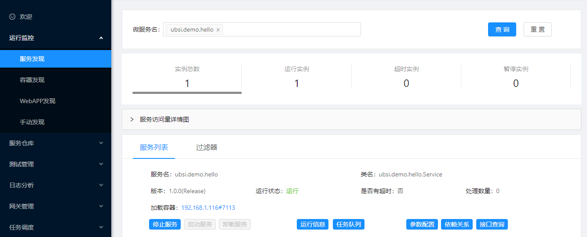

# 观察及访问

---

当微服务成功部署到服务容器后，我们如何观察其运行状态或访问其服务接口呢？


首先，我们可以使用UBSI治理工具的"服务发现"：



在这里，可以查看服务的运行状态、"启/停/卸载"服务、修改运行配置、查看接口并执行测试等。


如果没有启用UBSI治理工具，还可以使用UBSI核心包提供的命令行工具：

- rewin.ubsi.cli.Request - 接口访问工具

  ```
  java -cp ubsi-core-ce-2.3.1-jar-with-dependencies.jar rewin.ubsi.cli.Request -h localhost -p 7112 ubsi.demo.hello hello requester
  ```

- rewin.ubsi.cli.Console - 客户端交互工具

  ```
  > java -cp ubsi-core-ce-2.3.1-jar-with-dependencies.jar rewin.ubsi.cli.Console
  
  UBSI Consumer Console Utility, press ENTER for help
  
  localhost#7112> service
  
  [1] "": 2.3.0, rewin.ubsi.container.Controller, UBSI微服务容器控制器
  [1] ubsi.demo.hello: 1.0.0, ubsi.demo.hello.Service, UBSI微服务示例
  
  localhost#7112> request ubsi.demo.hello hello requester
  
  "ubsi: hello, requester"
  
  localhost#7112>
  ```


或者写一个完整的Java Consumer客户端：

```java
package ubsi.demo.hello;

import rewin.ubsi.consumer.Context;

/** 服务消费者测试类 */
public class Test {

    /** 命令行启动入口 */
    public static void main(String[] args) throws Exception {
        Context.startup(".");   // 启动UBSI Consumer，指定"."为当前工作目录
        callAsync();
        callSync();
        Context.shutdown();              // 关闭UBSI Consumer
    }

    // 同步方式请求
    static void callSync() throws Exception {
        Context ubsi = Context.request("ubsi.demo.hello", "hello", "consumer-sync"); // 创建UBSI请求对象
        String ack = (String)ubsi.call();    // 同步方式发送请求，并等待返回结果
        System.out.println("return: " + ack);
    }

    // 异步方式请求
    static void callAsync() throws Exception {
        Context ubsi = Context.request("ubsi.demo.hello", "hello", "consumer-async"); // 创建UBSI请求对象
        ubsi.callAsync((code, data) -> {
            // 在请求结果通知中的处理动作（如果是高耗时操作，为避免长时间占用I/O线程，应启动单独线程处理）
            System.out.println("code: " + code + ", data: " + data);
        }, false);   // 异步方式发送请求，通过回调得到结果
    }
}
```

在这个示例中，我们采用"call-路由"方式来访问微服务。与"direct-直连"方式不同，"路由"方式不需要指定微服务所在的容器地址，通常是通过"注册中心"来动态寻址，但在这个案例中，我们并没有配置"注册中心"，所以我们需要使用UBSI Consumer提供的"静态路由"机制。

在当前工作目录下手工创建rewin.ubsi.router.json文件，这个是UBSI Consumer的"静态路由表"，内容如下：

```json
[
  {
    "Service": "*",
    "Nodes": [
      {
        "Host": "localhost",
        "Port": 7112
      }
    ]
  }
]
```

这个路由配置表示：所有的微服务（"*"代表通配符）的访问请求都发送到"localhost#7112"容器节点。


执行这个测试：

`java -cp ubsi-core-ce-2.3.1-jar-with-dependencies.jar;target\classes ubsi.demo.hello.Test`

会得到下面的返回结果：

```
return: ubsi: hello, consumer-sync
code: 0, data: ubsi: hello, consumer-async
```


注：异步方式的回调接口的code参数表示请求是否正常，0表示成功，此时data参数表示实际的返回结果；code!=0表示失败，此时data为String类型的错误信息。关于错误代码的详细说明请见 [UBSI错误代码](../appendix/error-code.md)

