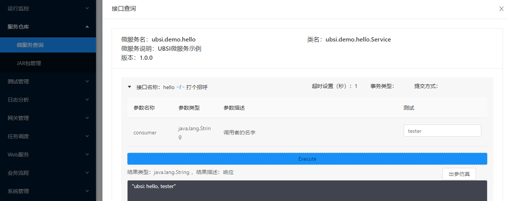

# 实现业务接口

---

准备完基础的Java开发环境，就可以开始UBSI微服务的开发了。

我们通过一个ServiceEntry类来实现微服务的业务接口（类的名字可以任意定义，但必须是public的），每个接口就是该类的一个public成员函数（非static的），并通过@USEntry注解进行声明，示例代码如下：

```java
package ubsi.demo.hello;

import rewin.ubsi.annotation.USAfter;
import rewin.ubsi.annotation.USBefore;
import rewin.ubsi.annotation.USEntry;
import rewin.ubsi.annotation.USParam;
import rewin.ubsi.container.ServiceContext;

/** 微服务的接口类（被主类继承） */
public class ServiceEntry {
    @USBefore
    public void before(ServiceContext ctx) {
        ctx.getLogger().info(Service.myName, "before");
    }

    @USAfter
    public void after(ServiceContext ctx) {
        ctx.getLogger().info(Service.myName, "after");
    }

    @USEntry(
            tips = "打个招呼",
            params = {
                    @USParam(name = "consumer", tips = "调用者的名字"),       // 接口参数说明
            },
            result = "响应",      // 返回值的说明
            readonly = true,     // 只读
            timeout = 1          // 超时设置（秒数）
    )
    /* 接口的第一个参数必须是ServiceContext，返回值可以是任意类型 */
    public String hello(ServiceContext ctx, String consumer) throws Exception {
        ctx.getLogger().info(Service.myName, "hello, " + consumer);
        return Service.myName + ": hello, " + consumer;
    }
}
```


@USEntry可以用来声明接口的说明、输入参数、返回值、是否只读、超时时间等，其中readonly属性参与了容器对接口的访问控制；timeout属性用来帮助容器检测接口的调用是否发生超时；

@USEntry声明的接口属性可以通过UBSI Repo服务仓库工具进行提取，进而形成统一的服务接口文档：



> 在UBSI治理工具的接口查询功能中，顺便还可以对接口做一下测试，如上图所示


这个服务只实现了一个非常简单的hello接口，如果需要多个接口，按照同样的方式进行声明和实现即可；需要注意的是：UBSI要求每个接口的第一个参数必须是一个ServiceContext对象，UBSI容器在收到外部请求并调用对应接口的时候，会通过这个对象传递请求的上下文；

> 更多信息可以参见 [ServiceContext API](../appendix/service-context.md)


UBSI服务接口的外部输入参数的数量没有限制，但是每个参数的数据类型必须是UBSI支持的基础数据类型。这是为了保证数据协议的"语言无关"特性，UBSI只按照特定的"基础数据类型"来传送数据，当发现不支持的类型时，UBSI会自动进行转换，如下表所示：

| 发送时的数据类型 | 接收时的数据类型（基础数据类型） |
| ---------------- | -------------------- |
| boolean | boolean |
| byte | byte |
| char, short, int | int (32位有符号整数) |
| long | long |
| BigInteger | BigInteger |
| float, double | double (64位双精度浮点数) |
| BigNumber | BigNumber |
| CharSequence, String | String |
| Map | HashMap |
| List | ArrayList |
| Set | HashSet |
| byte[] | byte[] |
| T[] (非byte[]的类型数组) | Object[] (对象数组) |
| java.util.regex.Pattern | java.util.regex.Pattern |
| T (其他Java Class) | Map<String, Object> (仅包含public成员变量) |

> 更多信息可以参见 [UBSI数据类型及编码方式](../appendix/data-type.md)


在这种"数据泛化"的机制下，UBSI的Consumer就不必依赖Provider的任何特定数据类型就可以自由访问所有的服务接口，这对Consumer的开发带来了很大的便利，但是需要注意：在数据接收端（如Provider的接口输入参数或Consumer的请求结果）都只能按照"基础数据类型"进行处理；

> 如果需要将收到的数据映射为特定的数据类型，可以参见 [UBSI数据类型转换的相关API](../appendix/data-codec.md)