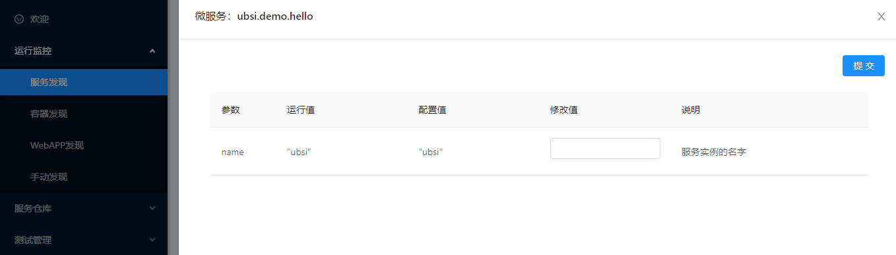

# 实现配置管理接口

---

UBSI的每个微服务都需要指定一个用@UService注解声明的类（服务类），所以仅仅一个ServiceEntry（接口类）是不够的，我们用一个继承了ServiceEntry的Service类来作为服务类，并且在这个类中实现微服务的配置管理接口。代码如下：

```java
package ubsi.demo.hello;

import rewin.ubsi.annotation.*;
import rewin.ubsi.common.Util;
import rewin.ubsi.container.ServiceContext;

/** 微服务的主类 */
@UService(
        name = Service.SERVICE_NAME,    // 默认的服务名字
        tips = "UBSI微服务示例",         // 服务说明
        version = "1.0.0",              // 接口的版本
        release = false                 // 发布状态，false表示社区版
)
public class Service extends ServiceEntry {
    final static String SERVICE_NAME = "ubsi.demo.hello";   // 默认的服务名字
    final static String CONFIG_FILE = "config.json";        // 配置文件名

    static String myName = "ubsi";      // 参数配置项，用来demo动态参数配置

    /** 服务实例启动时的初始化动作 */
    @USInit
    public static void init(ServiceContext ctx) throws Exception {
        // 读取配置文件
        Config config = ctx.readDataFile(CONFIG_FILE, Config.class);
        if ( config != null ) {
            // 读到了配置文件，根据配置文件设置运行参数
            myName = config.name;
        }
        /*
          如果还有其他资源/配置文件放在resources下，可以使用ctx.getResourceAsStream("filename")来读取
         */

        // 输出服务启动日志
        ctx.getLogger().info("start", myName);
    }

    /** 服务实例停止时的资源清理动作 */
    @USClose
    public static void close(ServiceContext ctx) throws Exception {
        // 输出服务停止日志
        ctx.getLogger().info("stop", myName);
    }

    /** 返回运行信息 */
    @USInfo
    public static String info(ServiceContext ctx) throws Exception {
        return myName;
    }

    /** 返回配置参数 */
    @USConfigGet
    public static Config getConfig(ServiceContext ctx) throws Exception {
        Config config = new Config();
        config.name = myName;           // 配置项的运行值
        config.name_restart = myName;   // 配置项的配置值（该配置项立即生效，不需要从配置文件中读取）
        return config;
    }

    /** 设置配置参数 */
    @USConfigSet
    public static void setConfig(ServiceContext ctx, String json) throws Exception {
        Config config = Util.json2Type(json, Config.class);
        myName = config.name;   // 动态修改运行参数（如果配置参数要求微服务必须重启后才能生效，则不能立即修改运行值，只能保存配置文件）
        ctx.saveDataFile(CONFIG_FILE, config);  // 保存配置文件
    }
}
```

@UService注解的name表示微服务的默认名字（在实例部署时还可以指定为其他的名字），微服务的名字、接口版本以及发行状态都会被容器自动注册到注册中心，并参与UBSI Consumer的路由算法。（在A/B测试及灰度发布时，可以配置路由算法指向特定版本的服务实例）；

在正常情况下，微服务应该是"无状态"的，这样在运行时，可以部署微服务的多个实例来实现负载分散以及容错；但有些处理特定业务场景的微服务需要以"活动单例"方式来运行（只能存在一个"活动"的运行实例，比如：依赖内存数据进行业务处理、存在不能并行的定时/轮询任务等），这时只需要将@UService注解的singleton属性设置为true，这个微服务就可以从"无状态"的多实例"并行"模式转化为"有状态"的多实例"主备"模式：

- 当前只有一个实例处于"运行"状态（主实例），其他实例都处于"standby"状态
- 当主实例失效或停止后，容器会立刻选择一个standby实例进入"运行"状态，切换动作可以在毫秒级完成
- 之前的实例恢复后，会进入standby状态，成为一个后备实例

> 更多@UService注解的说明请参见 [UBSI注解](../appendix/annotation.md)


------


除了@UService，微服务还可以通过下面几个接口来为UBSI容器/治理工具提供配置管理能力：

- @USInit：微服务启动时的初始化
- @USClose: 微服务停止时的资源清理
- @USInfo: 提供运行时信息
- @USConfigGet: 提供运行配置参数
- @USConfigSet: 设置运行配置参数

> 使用这些注解的接口必须是public static的，更多注解请参见 [UBSI注解](../appendix/annotation.md)


UBSI不会替微服务保存或"生效"配置参数，这些应该由微服务在@USInit/@USConfigSet中进行处理；但UBSI会提供一个统一的参数查看/配置工具，只需要微服务按照@USConfigGet的约定，返回正确的配置信息即可。在本示例中，微服务只有一个配置项，定义在Config类中：

```java
package ubsi.demo.hello;

/** 微服务的配置 */
public class Config {
    public String name;                         // 配置项的当前运行值
    public String name_restart;                 // 配置项的配置值（在配置文件中的值，非当前值）
                                                // 如果配置项修改后须重启才能生效，则通过???_restart返回
    public String name_comment = "服务实例的名字";	// 配置项的说明，通过???_comment返回
}
```

开发者可以在UBSI治理工具中看到的微服务参数配置页面：




UBSI允许为微服务的每个实例单独设置配置参数，也可以将配置信息保存在"服务仓库"该微服务的"默认配置"中，继而推送到微服务的其他运行实例；"服务仓库"的部署工具在部署新实例时也会自动应用这个"默认配置"。

