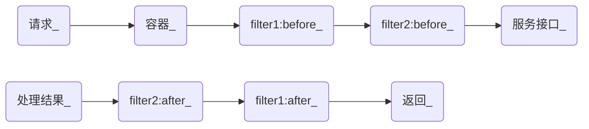
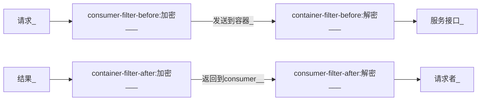

# 过滤器开发

---

UBSI的过滤器分为容器端过滤器(container-filter)和访问端过滤器(consumer-filter)。

容器端过滤器类似于微服务，只能部署在容器内运行，与微服务不同的是，过滤器没有名字，也没有服务接口，只有通过@USBefore/@USAfter两个注解声明的"拦截点"，可以在微服务接口被访问前/后进行拦截处理，以扩展容器/微服务的处理机制。

过滤器通常会被用来实现更复杂的微服务访问认证、授权、加密、统计等；一个容器内可以部署多个过滤器，服务请求到达容器时，会按照链状顺序进行前/后置处理，如下所示：

访问端的过滤器是一个实现了rewin.ubsi.consumer.Context.Filter接口的Java类，同样是通过before/after两个接口，来对consumer发出服务请求之前及收到请求结果之后进行拦截处理；设置consumer-filter需要通过配置文件rewin.ubsi.consumer.json来进行，同样可以设置多个filter，处理序列与container-filter相同。

我们会通过一个简单的例子来介绍UBSI过滤器的开发：

- [过滤器Project](project.md)
- [容器端过滤器](container.md)
- [访问端过滤器](consumer.md)
- [部署及测试](test.md)

这个例子用来演示在访问ubsi.demo.hello的hello()接口时，对参数和返回结果进行加解密的过程；加解密动作是对称的，所以同时需要container-filter及consumer-filter，具体过程如下：

完整的示例代码可以访问：

https://github.com/open-ubsi/demo.filter

