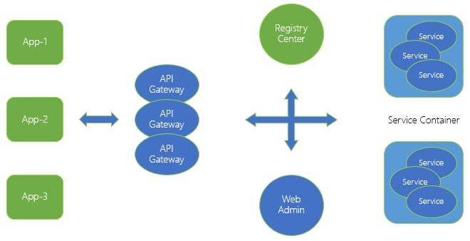
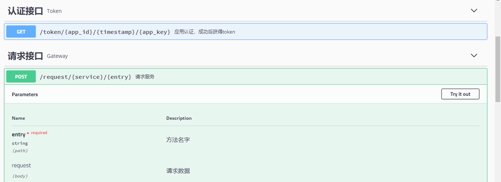
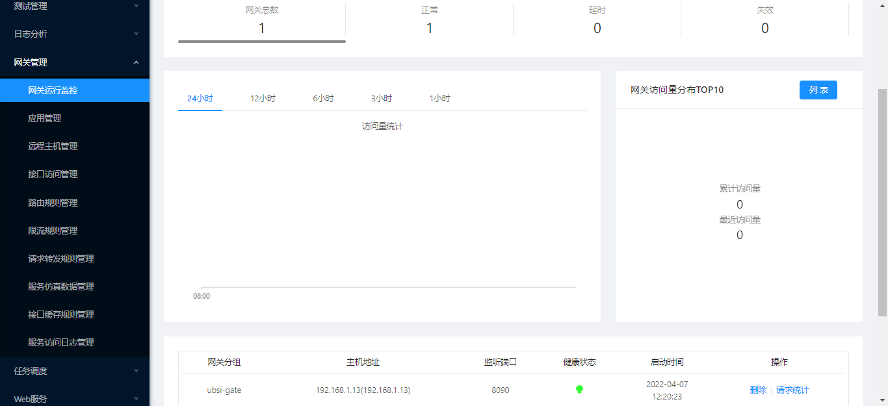

# 服务网关

---

在复杂的企业IT系统环境中，各种不同的业务系统（应用）可能是用不同的技术方案（异构）独立建设的，但是由"微服务"所代表的核心业务逻辑在应用之间应该是一致并且可以被"共享"的。在这种环境下，"微服务"已经不再仅仅是单一应用内的架构模式，而是可以成为企业内保障关键业务能力的"中台"系统。

UBSI API Gateway（服务网关）为企业内的各种异构应用访问"微服务"提供了"统一"的接口及管控机制，逻辑架构如下：

UBSI-Gateway是一个独立的Web应用（WebApp，但不包含前端界面），通过rest-api为其他应用或异构系统提供UBSI微服务的访问能力。

UBSI-Gateway为第三方应用提供了丰富的访问策略，包括：

- 应用认证、接口/主机授权
- 路由规则
- 限流策略
- 流量镜像/转发（分流）
- 接口仿真及缓存
- 访问统计及日志

UBSI-Gateway通过 微服务rewin.ubsi.gateway 来存取访问策略及数据，管理人员可以通过UBSI治理工具来配置这些策略。

> UBSI-Gateway服务网关目前只在UBSI正式版本中提供，详见 https://ubsi-home.github.io/docs/gateway/readme.html

